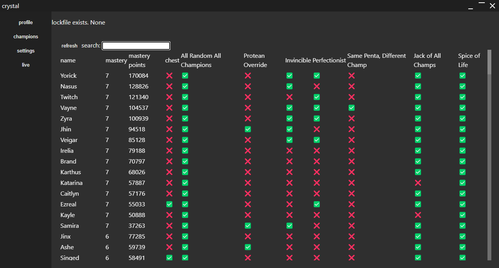

# Crystal Client

In progress app (based off my [not-yet-finished Kotlin project](https://github.com/Jeffmagma/crystal)) that allows users to view their challenge progress, mainly to help me learn Rust and Svelte

Built with Tauri (Rust + Vite + Typescript + Svelte)

### Recommended IDE Setup
(generated by the project)

[VS Code](https://code.visualstudio.com/) + [Svelte](https://marketplace.visualstudio.com/items?itemName=svelte.svelte-vscode) + [Tauri](https://marketplace.visualstudio.com/items?itemName=tauri-apps.tauri-vscode) + [rust-analyzer](https://marketplace.visualstudio.com/items?itemName=rust-lang.rust-analyzer).
